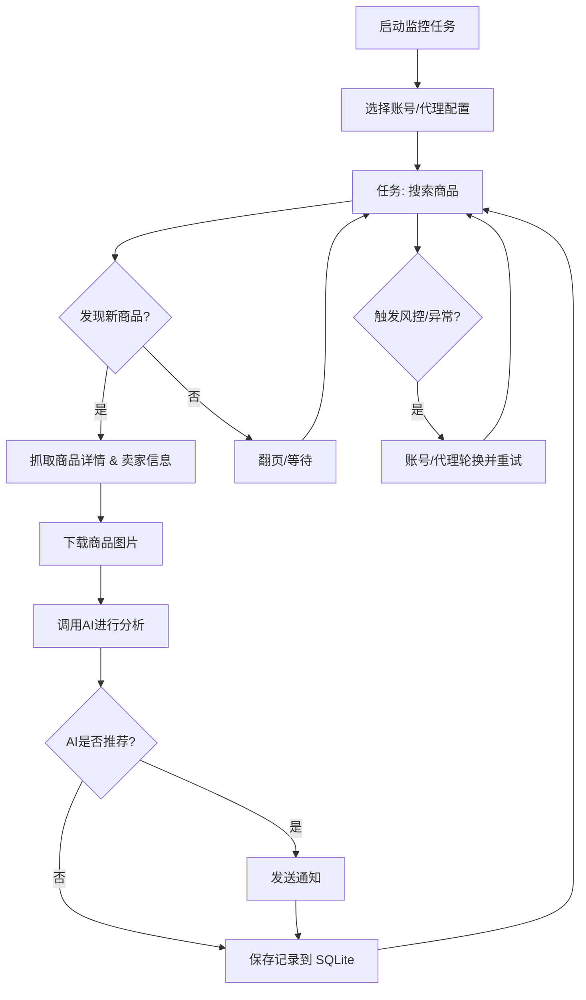

# 闲鱼智能监控系统

[中文] ｜ [English](README_EN.md)

基于 Playwright 和 AI 的闲鱼多任务实时监控，提供完整的 Web 管理界面。


## 核心特性

- **Web 可视化管理**: 任务管理、账号管理、AI 标准编辑、运行日志、结果浏览
- **AI 驱动**: 自然语言创建任务，多模态模型深度分析商品
- **多任务并发**: 独立配置关键词、价格、筛选条件和 AI Prompt
- **高级筛选**: 包邮、新发布时间范围、省/市/区三级区域筛选
- **即时通知**: 支持 ntfy.sh、企业微信、Bark、Telegram、Webhook等多渠道
- **定时调度**: 支持 Cron 配置周期性任务
- **账号与代理轮换**: 多账号管理、任务绑定账号、代理池轮换与失败重试
- **Docker 部署**: 一键容器化部署

## 截图


## 🐳 Docker 部署（推荐）

```bash
git clone https://github.com/Daiobs/ai-goofish-monitor && cd ai-goofish-monitor
cp .env.example .env
vim .env # 填写相关配置项
docker compose up -d --build
docker compose logs -f app
docker compose down
```

- 默认 Web UI 地址：`http://127.0.0.1:8000`
- 默认 Compose 端口只绑定宿主机 `127.0.0.1`，局域网中的其他设备无法直接访问。
- 默认从当前仓库 checkout 的源码构建本地镜像 `ai-goofish-monitor:local`，确保运行内容与当前分支一致。
- 可通过 `APP_IMAGE` 覆盖构建产物的本地镜像名称；未来自行发布镜像后，也可在 `--no-build` 模式下使用该变量。Fork 当前不提供自动镜像发布工作流。
- Docker 镜像已内置 Chromium，无需宿主机额外安装浏览器。
- 更新源码后重新运行 `docker compose up -d --build` 即可重建并启动。
- 如果你修改了 `.env` 中的 `SERVER_PORT`，请同步更新 `docker-compose.yaml` 里的端口映射。
- `docker-compose.yaml` 默认会把 SQLite 主库挂载到 `./data:/app/data`，数据库文件默认为 `data/app.sqlite3`
- 目前默认持久化这些目录：
    - `data/`  SQLite 主存储（任务、结果、价格历史）
    - `state/`  登录状态 cookie 文件
    - `prompts/`  任务提示词
    - `logs/`  运行日志
    - `images/`  商品图片与任务临时图片目录
    - `config.json`、`jsonl/`、`price_history/`  首次升级到 SQLite 时用于兼容导入的旧数据源

> 安全提示：暴露到局域网或公网前，必须修改 `WEB_USERNAME` / `WEB_PASSWORD`，设置高强度 `SESSION_SECRET` 和 `APP_ENV=production`，通过 HTTPS 反向代理提供服务，并设置 `SESSION_COOKIE_SECURE=true`。不要直接把应用端口暴露到公网。

### 数据存储与迁移

- 当前在线主存储为 SQLite，默认路径 `data/app.sqlite3`
- 可通过环境变量 `APP_DATABASE_FILE` 自定义数据库路径；Docker 默认设置为 `/app/data/app.sqlite3`
- 应用启动时会自动建库建表，并尝试从旧的 `config.json`、`jsonl/`、`price_history/` 导入一次历史数据
- `state/`、`prompts/`、`logs/`、`images/` 仍然是文件系统目录，不在 SQLite 中
- 商品图片会临时落到 `images/task_images_<task_name>/`，任务结束后默认会清理
- 首次升级完成并确认 `data/app.sqlite3` 中数据正确后，可视部署方式决定是否继续保留旧的 `config.json`、`jsonl/`、`price_history/` 挂载

### 最少配置

| 变量 | 说明 | 必填 |
|------|------|------|
| `OPENAI_API_KEY` | AI 模型 API Key | 是 |
| `OPENAI_BASE_URL` | OpenAI 兼容接口地址 | 是 |
| `OPENAI_MODEL_NAME` | 支持图片输入的模型名称 | 是 |
| `WEB_USERNAME` / `WEB_PASSWORD` | Web UI 登录账号密码，默认 `admin/admin123` | 否 |
| `SESSION_SECRET` | Session 签名密钥；生产环境必须设置高强度随机值 | 生产必填 |

其余配置见下方“配置说明”。


### 第一次使用

1. 打开默认 Web UI `http://127.0.0.1:8000` 并登录。
2. 进入“闲鱼账号管理”，使用 [Chrome 扩展](https://chromewebstore.google.com/detail/xianyu-login-state-extrac/eidlpfjiodpigmfcahkmlenhppfklcoa) 导出并粘贴闲鱼登录态 JSON。
3. 登录态文件会保存到 `state/` 目录，例如 `state/acc_1.json`。
4. 回到“任务管理”，创建任务并绑定账号后即可运行。

### 创建第一个任务

- `AI判断`：填写“详细需求”，提交后会弹出独立进度弹窗，后台异步生成分析标准。
- `关键词判断`：填写关键词规则，任务会直接创建，不经过 AI 生成流程。
- `区域筛选`：已改为省 / 市 / 区三级选择器，数据基于闲鱼页面抓取快照内置。


## 用户使用说明

<details>
<summary>点击展开 Web UI 功能说明</summary>

### 任务管理

- 支持 AI 创建、关键词规则、价格范围、新发布范围、区域筛选、账号绑定、定时规则。
- AI 任务创建是后台 job 流程，提交后会打开单独的进度弹窗。
- 区域筛选会显著缩小结果集，默认留空。

### 账号管理

- 支持导入、更新、删除闲鱼账号登录态。
- 每个任务可指定账号，也可不绑定并交给系统自动选择。

### 结果查看与运行日志

- 结果页和导出功能现在从 SQLite 查询，不再直接扫描 `jsonl` 文件。
- 日志页按任务展示运行过程，便于排查登录态失效、风控和 AI 调用问题。

### 系统设置

- 可查看系统状态、编辑 Prompt、调整代理与轮换相关配置。

</details>


## 开发者开发

### 环境要求

- Python 3.11（CI 与受支持运行时；不支持 Python 3.9）
- Node.js 22 + npm
- Playwright CLI 与 Chromium，首次运行前建议执行 `python3 -m pip install playwright && python3 -m playwright install chromium`
- Chrome / Edge 浏览器（Linux 环境也可使用 Chromium；`start.sh` 会先检查浏览器是否存在）

```bash
git clone https://github.com/Usagi-org/ai-goofish-monitor
cd ai-goofish-monitor
cp .env.example .env
```

### 一键启动

```bash
chmod +x start.sh
./start.sh
```

`start.sh` 会先检查 Playwright CLI 和浏览器前置条件；在前置条件满足后自动安装项目依赖、构建前端、复制构建产物并启动后端。

### 手动启动

```bash
# 后端
python -m src.app
# 或
uvicorn src.app:app --host 0.0.0.0 --port 8000 --reload

# 前端
cd web-ui
npm install
npm run dev
```

- FastAPI 启动时会自动初始化 SQLite，并在首次启动时尝试导入旧的 `config.json/jsonl/price_history`
- `spider_v2.py` 默认从 SQLite 读取任务；只有显式传入 `--config <path>` 时才会走 JSON 配置兼容模式
- 默认数据库路径为 `data/app.sqlite3`
- Vite 开发服务器会将 `/api`、`/auth`、`/ws` 代理到 `http://127.0.0.1:8000`。
- `npm run build` 先生成 `web-ui/dist/`，`start.sh` 再复制到仓库根目录 `dist/`。
- FastAPI 负责提供根目录 `dist/index.html` 和 `dist/assets/`。
- `./start.sh` 默认输出访问地址 `http://localhost:8000` 和 API 文档 `http://localhost:8000/docs`。

### 测试与校验

必需检查、本地复现、依赖锁和 branch protection 说明见 [CI 与必需质量门禁](docs/ci.md)。

### 任务创建 API

<details>
<summary>点击展开 API 行为说明</summary>

- `POST /api/tasks/generate`
  - `decision_mode=ai`：返回 `202` 和 `job`，需要继续轮询进度。
  - `decision_mode=keyword`：直接返回已创建任务。
- `GET /api/tasks/generate-jobs/{job_id}`：查询 AI 任务生成进度。
- `POST /auth/login`：校验凭据并设置签名 Session Cookie。
- `POST /auth/logout`：清除 Session Cookie。
- `GET /auth/session`：查询当前浏览器 Session。

</details>

## 配置说明

<details>
<summary>点击展开常用配置项</summary>

### AI 与运行时

- `OPENAI_API_KEY` / `OPENAI_BASE_URL` / `OPENAI_MODEL_NAME`：AI 模型接入必填项。
- `PROXY_URL`：为 AI 请求单独指定 HTTP/SOCKS5 代理。
- `RUN_HEADLESS`：是否以无头模式运行爬虫；Docker 中应保持 `true`。
- `SERVER_PORT`：后端监听端口，默认 `8000`。
- `APP_ENV`：运行环境，默认 `development`；设为 `production` 后，弱密钥、缺失密钥或 `SESSION_COOKIE_SECURE=false` 都会导致启动失败。
- `SESSION_SECRET`：Session 签名密钥，生产环境使用至少 32 字节的高强度随机值。
- `SESSION_MAX_AGE_SECONDS`：Session 有效期，默认 `86400` 秒。
- `SESSION_COOKIE_SECURE`：是否只允许浏览器通过 HTTPS 发送 Session Cookie；本地 HTTP 默认 `false`，HTTPS 部署必须设为 `true`。
- `LOGIN_IS_EDGE`：本地环境可切换为 Edge 内核；Docker 镜像未内置 Edge，容器内会固定使用 Chromium。
- `PCURL_TO_MOBILE`：是否将 PC 商品链接转换为移动端链接。

### 通知

- `NTFY_TOPIC_URL`
- `GOTIFY_URL` / `GOTIFY_TOKEN`
- `BARK_URL`
- `WX_BOT_URL`
- `TELEGRAM_BOT_TOKEN` / `TELEGRAM_CHAT_ID` / `TELEGRAM_API_BASE_URL`
- `WEBHOOK_*`

### 代理轮换与失败保护

- `PROXY_ROTATION_ENABLED`
- `PROXY_ROTATION_MODE`
- `PROXY_POOL`
- `PROXY_ROTATION_RETRY_LIMIT`
- `PROXY_BLACKLIST_TTL`
- `TASK_FAILURE_THRESHOLD`
- `TASK_FAILURE_PAUSE_SECONDS`
- `TASK_FAILURE_GUARD_PATH`

完整示例见 `.env.example`。

</details>

## Web 界面认证

<details>
<summary>点击展开认证说明</summary>

- Web UI 通过 `POST /auth/login` 登录，后端设置 `HttpOnly`、`SameSite=Strict`、`Path=/` 的签名 Session Cookie；Cookie 的 `Secure` 属性由 `SESSION_COOKIE_SECURE` 控制。
- 前端启动时调用 `GET /auth/session` 恢复认证状态，退出时调用 `POST /auth/logout`；密码、Session Token 和可信登录标记不会写入 `localStorage` 或 `sessionStorage`。
- `/health` 允许匿名访问；任务、账号、结果、日志、Prompt、设置等 `/api/*` 接口及 `/ws` 均要求有效 Session。
- 开发环境未配置高强度 `SESSION_SECRET` 时会生成临时密钥并告警，重启后已有 Session 失效；生产模式要求固定高强度密钥，并强制 `SESSION_COOKIE_SECURE=true`，否则拒绝启动。
- 默认凭据仅供本机首次启动。对局域网或公网开放前，必须设置正式凭据、固定高强度密钥、HTTPS 反向代理和 Secure Cookie。

</details>

## 🚀 工作流程

下图描述了单个监控任务从启动到完成的核心处理逻辑。主服务运行于 `src.app`，按用户操作或定时调度启动一个或多个任务进程。



## 常见问题

<details>
<summary>点击展开常见问题</summary>

### AI 任务创建为什么不是立即完成？

AI 模式会先生成分析标准，再创建任务。现在该流程已改为后台 job，提交后会显示独立进度弹窗，避免表单长时间卡住。

### 区域筛选为什么默认建议留空？

区域筛选会显著减少搜索结果，适合明确只看某个区域的场景。若你先验证整体市场，建议先不填。

### 本地页面打开后提示前端构建产物不存在？

说明根目录 `dist/` 缺失。可直接执行 `./start.sh`，或先在 `web-ui/` 里执行 `npm run build`，再确认构建产物已复制到仓库根目录。

### `./start.sh` 为什么提示缺少 Playwright 或浏览器？

这是脚本的前置检查。请先安装 Playwright CLI 与 Chromium，并确保系统中可用 Chrome / Edge（Linux 环境也可用 Chromium），然后重新执行 `./start.sh`。

</details>


## 致谢

<details>
<summary>点击展开致谢内容</summary>

本项目在开发过程中参考了以下优秀项目，特此感谢：

- [superboyyy/xianyu_spider](https://github.com/superboyyy/xianyu_spider)

以及感谢LinuxDo相关人员的脚本贡献

- [@jooooody](https://linux.do/u/jooooody/summary)

以及感谢 [LinuxDo](https://linux.do/) 社区。

以及感谢 ClaudeCode/Gemini/Codex 等模型工具，解放双手 体验Vibe Coding的快乐。

</details>


## 注意事项

<details>
<summary>点击展开注意事项详情</summary>

- 请遵守闲鱼的用户协议和robots.txt规则，不要进行过于频繁的请求，以免对服务器造成负担或导致账号被限制。
- 本项目仅供学习和技术研究使用，请勿用于非法用途。
- 本项目采用 [MIT 许可证](LICENSE) 发布，按"现状"提供，不提供任何形式的担保。
- 项目作者及贡献者不对因使用本软件而导致的任何直接、间接、附带或特殊的损害或损失承担责任。
- 如需了解更多详细信息，请查看 [免责声明](DISCLAIMER.md) 文件。

</details>

## Star History

[](https://www.star-history.com/#Usagi-org/ai-goofish-monitor&Date)


